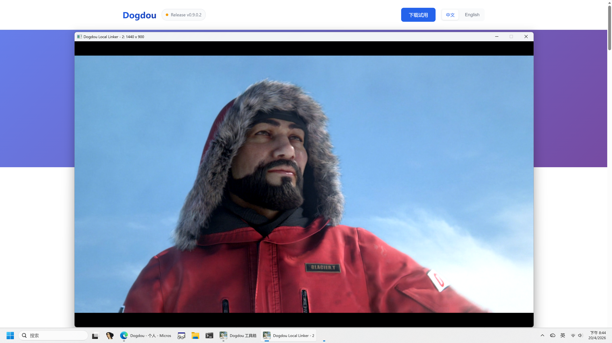

# Dogdou

## 中文

轻量级 Windows 容器与隔离运行环境。

Dogdou 面向软件隔离、多开、沙箱、远程桌面、AI/MCP 集成等场景，目标是在比传统虚拟机更轻的代价下提供更强的运行隔离能力。

[下载最新版本](./../../releases/latest)
|
[中文使用指南](./docs/guide.zh-CN.md)
|
[英文使用指南](./docs/guide.en.md)
|
[中文常见问题](./docs/FAQ.zh-CN.md)
|
[英文常见问题](./docs/FAQ.en.md)
|
[中文变更日志](./docs/changelog.zh-CN.md)
|
[英文变更日志](./docs/changelog.en.md)
|
[官方站点](https://snowwildfox.com/)

### 产品定位

- 基于 Windows 容器技术构建的轻量隔离运行环境
- 适合软件多开、恶意软件分析、受控测试、桌面虚拟化等场景
- 支持 MCP 方向的集成，便于 AI 模型与容器环境协作
- 支持图形与远程访问相关能力，覆盖更接近真实桌面工作负载的需求

### 为什么是 Dogdou

- 比完整虚拟机更轻，启动与资源开销更低
- 比普通沙箱更接近可运营、可管理、可集成的容器环境
- 能覆盖开发、测试、工作室运营、远程桌面与安全研究等多类需求

### 下载

安装包不存放在仓库代码树中。

- 请从仓库顶部的 [Releases](./../../releases) 页签下载正式版本
- README 中的下载入口直接指向“下载最新版本”
- 如版本页面提供校验文件，可一并下载用于完整性校验

如果你是从 GitHub 仓库首页进入，推荐直接点击上方“下载最新版本”。

### 快速开始

1. 下载安装包并以管理员身份运行。
2. 安装程序会把文件部署到 `%ProgramData%\Dogdou`。
3. 打开 `DogdouToolkit.exe`。
4. 先在 `凭据` 页面创建凭据。
5. 返回 `会话` 页面，选择凭据并填写显示参数。
6. 点击 `启动会话` 启动会话，再通过 `创建进程` 和 `连接会话` 进入环境。

详细说明见：

- [中文使用指南](./docs/guide.zh-CN.md)
- [英文使用指南](./docs/guide.en.md)
- [中文常见问题](./docs/FAQ.zh-CN.md)
- [英文常见问题](./docs/FAQ.en.md)
- [中文变更日志](./docs/changelog.zh-CN.md)
- [英文变更日志](./docs/changelog.en.md)

## English

Lightweight Windows container and isolated runtime environment.

Dogdou is designed for software isolation, multi-instance workflows, sandboxing, remote desktop scenarios, and AI/MCP integration, aiming to deliver stronger runtime isolation than traditional virtual machines at a lower cost.

[Latest Release](./../../releases/latest)
|
[Chinese Guide](./docs/guide.zh-CN.md)
|
[English Guide](./docs/guide.en.md)
|
[Chinese FAQ](./docs/FAQ.zh-CN.md)
|
[English FAQ](./docs/FAQ.en.md)
|
[Chinese Changelog](./docs/changelog.zh-CN.md)
|
[English Changelog](./docs/changelog.en.md)
|
[Official Site](https://snowwildfox.com/)

### Product Positioning

- A lightweight isolated runtime environment built on Windows container technology
- Suitable for software multi-instance usage, malware analysis, controlled testing, desktop virtualization, and similar scenarios
- Supports MCP-oriented integration so AI models can collaborate more easily with containerized environments
- Supports graphics and remote-access capabilities for workloads closer to real desktop usage

### Why Dogdou

- Lighter than full virtual machines, with lower startup and resource overhead
- More operable, manageable, and integrable than ordinary sandboxes
- Suitable for development, testing, studio operations, remote desktop, and security research use cases

### Download

Installer packages are not stored in the repository tree.

- Download official releases from the repository's [Releases](./../../releases) tab
- The download entry in this README links directly to "Latest Release"
- If checksum files are provided on the release page, download them together for integrity verification

If you arrived from the GitHub repository homepage, the recommended entry is the "Latest Release" link above.

### Quick Start

1. Download the installer and run it as administrator.
2. The installer deploys files to `%ProgramData%\Dogdou`.
3. Open `DogdouToolkit.exe`.
4. Create credentials on the `Credentials` page first.
5. Return to the `Session` page, select credentials, and fill in the display parameters.
6. Click `Start Session` to launch a session, then enter the environment through `Create Process` and `Link Session`.

See also:

- [Chinese Guide](./docs/guide.zh-CN.md)
- [English Guide](./docs/guide.en.md)
- [Chinese FAQ](./docs/FAQ.zh-CN.md)
- [English FAQ](./docs/FAQ.en.md)
- [Chinese Changelog](./docs/changelog.zh-CN.md)
- [English Changelog](./docs/changelog.en.md)
