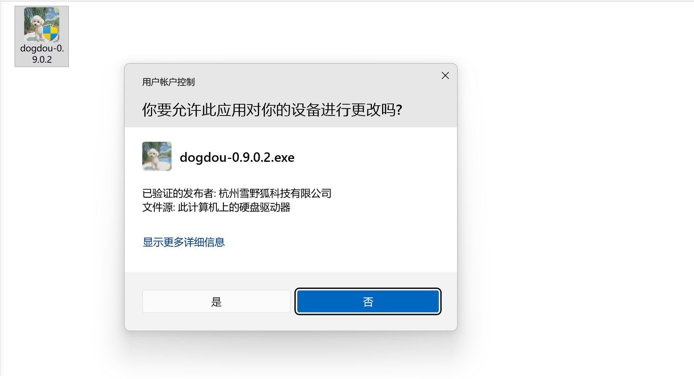
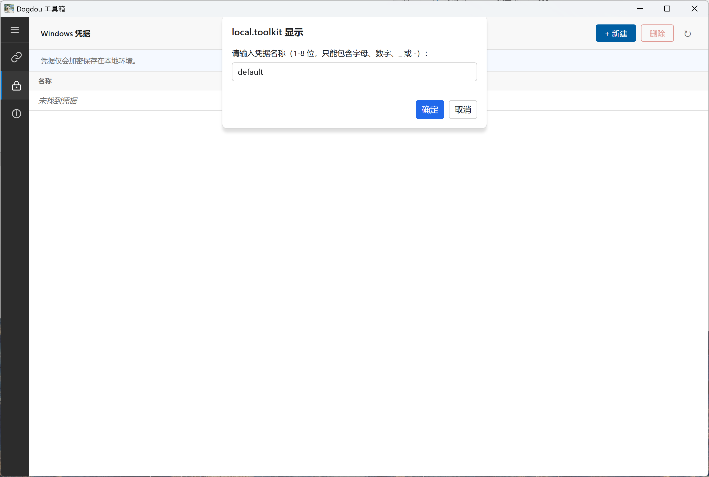
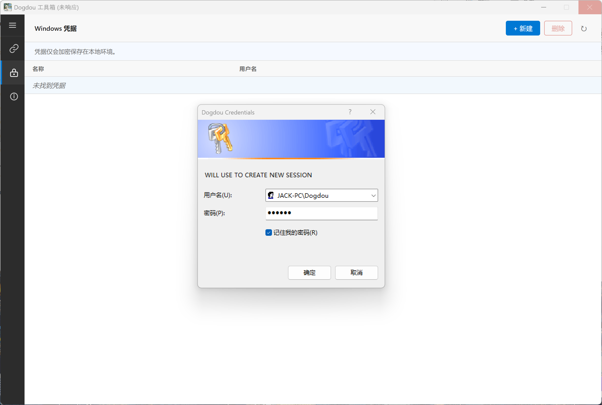
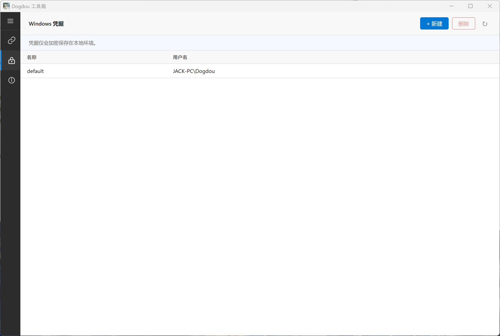
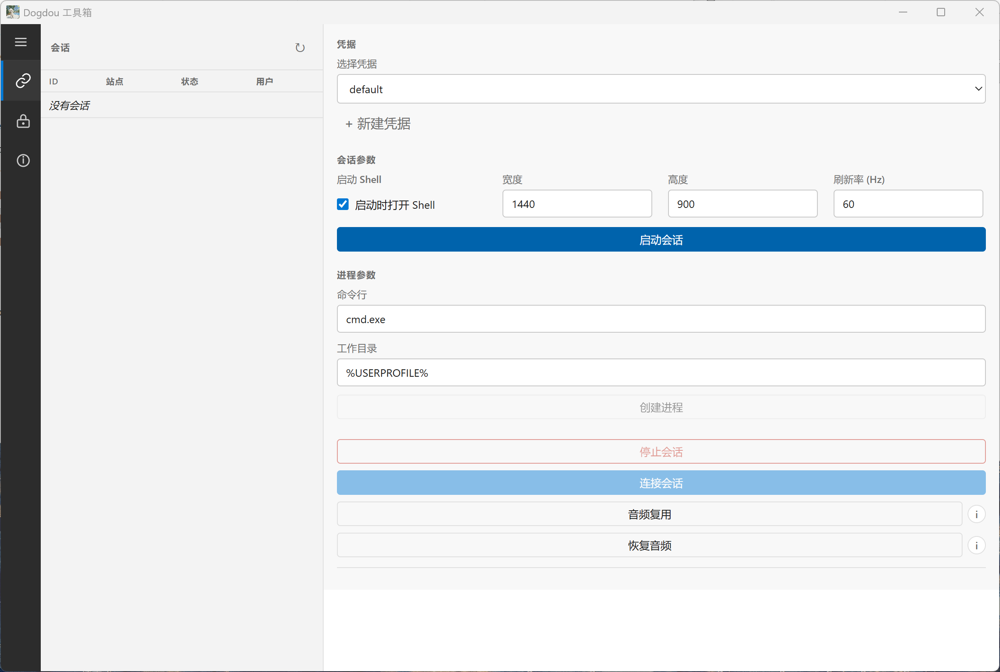
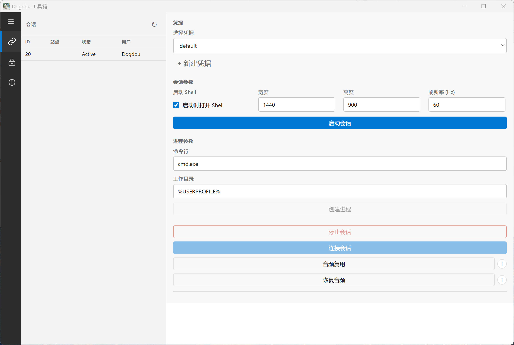
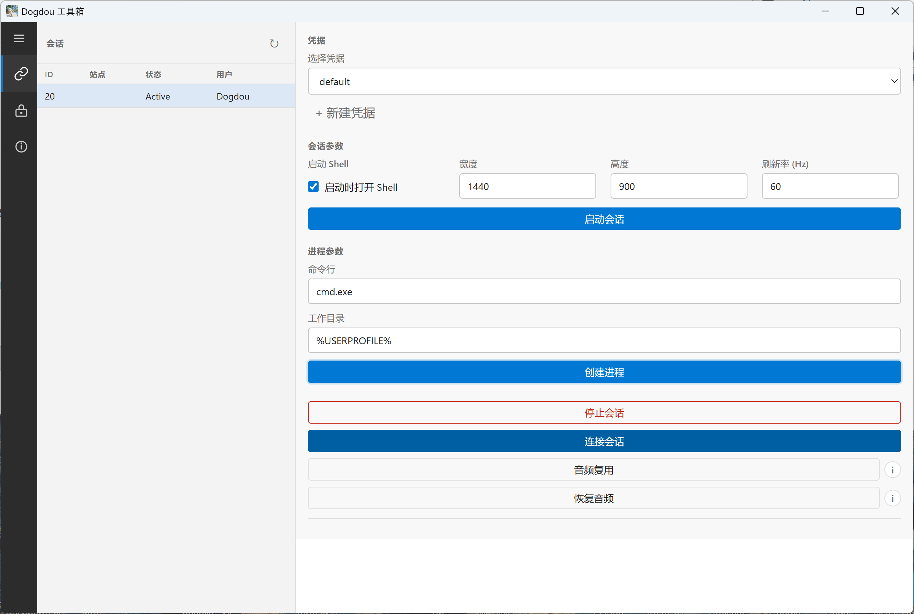
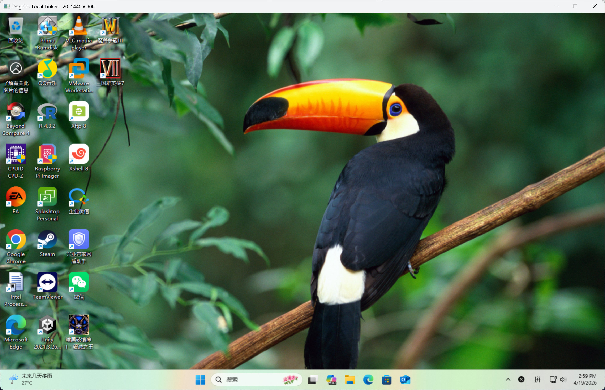

# Dogdou 使用指南

[返回仓库首页](../README.md) | [English Guide](./guide.en.md) | [中文变更日志](./changelog.zh-CN.md)

## 安装

1. 从仓库 `Releases` 页签下载安装包。
2. 以管理员权限运行安装程序。
3. 安装文件会被复制到 `%ProgramData%\Dogdou`。
4. 安装程序会注册卸载项、驱动与 `DogdouService` 服务。

说明：

- 安装包不存放在仓库代码树中
- 正式 `.exe` 和校验文件应从发布页下载

## 首次启动

1. 从桌面快捷方式或安装目录启动 `DogdouToolkit.exe`。
2. 左侧当前主要入口包括：
   - `Session`
   - `Credentials`
   - `About`
3. 首次使用建议先创建一个凭据。

## 创建凭据

1. 打开 `Credentials` 页面。
2. 点击 `+ New`。
3. 创建一个后续用于会话启动的凭据条目。

## 启动会话

1. 返回 `Session` 页面。
2. 在 `Select Credential` 中选择凭据。
3. 填写宽度、高度和刷新率。
4. 如需 shell，可启用 `Start with shell`。
5. 点击 `Start Session`。

真实界面截图：

## 创建进程并连接

1. 在会话列表中确认会话已创建。
2. 在 `Command Line` 中填写程序，例如 `cmd.exe`。
3. 在 `Work Directory` 中填写目录，例如 `%USERPROFILE%`。
4. 点击 `Create Process`。
5. 点击 `Link Session` 进入该环境。
6. 如有音频恢复需求，可使用 `Resume Audio`。
